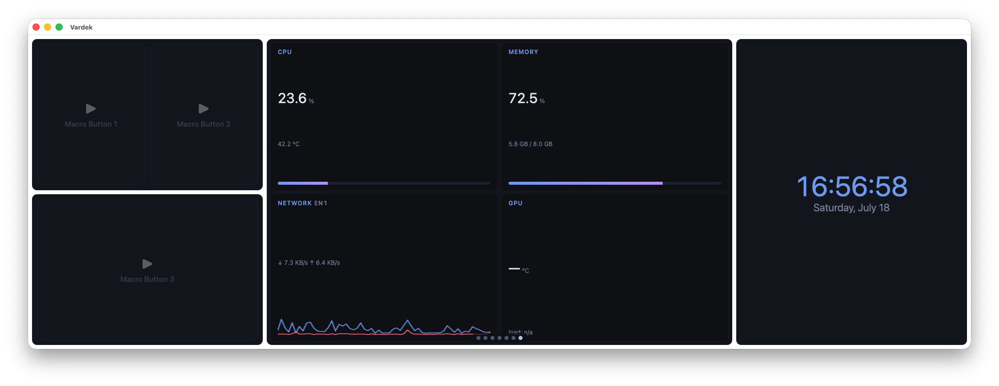
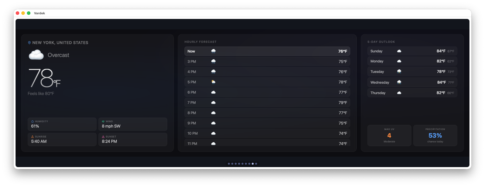
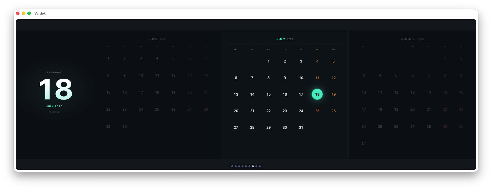
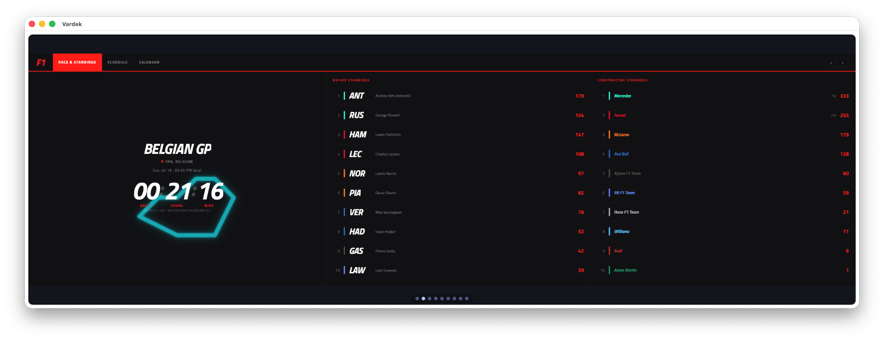
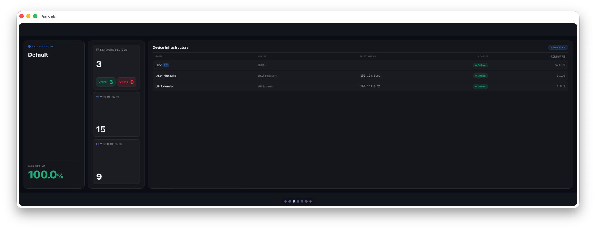
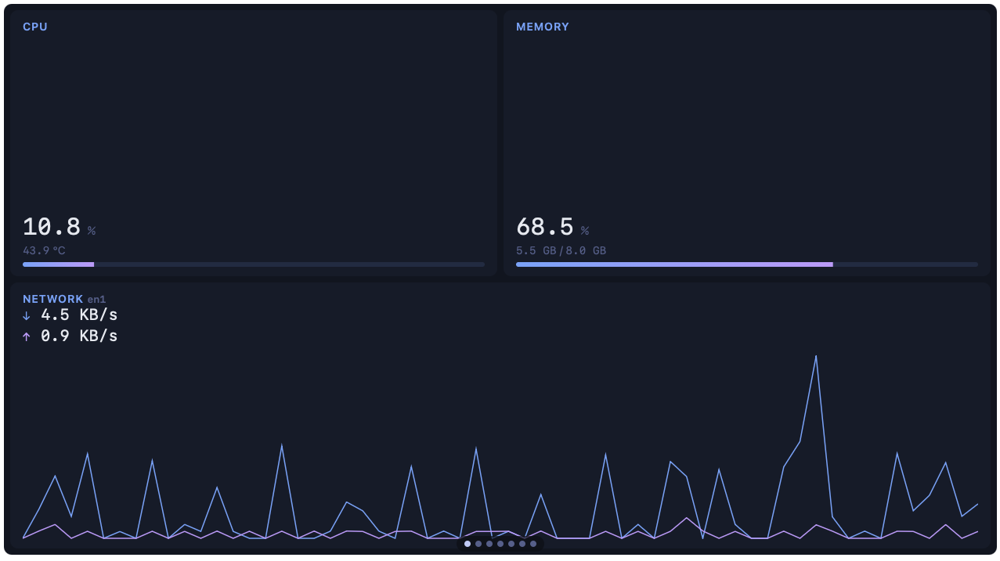
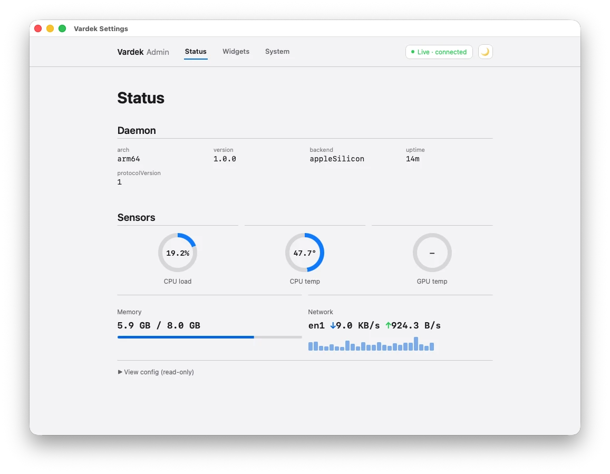
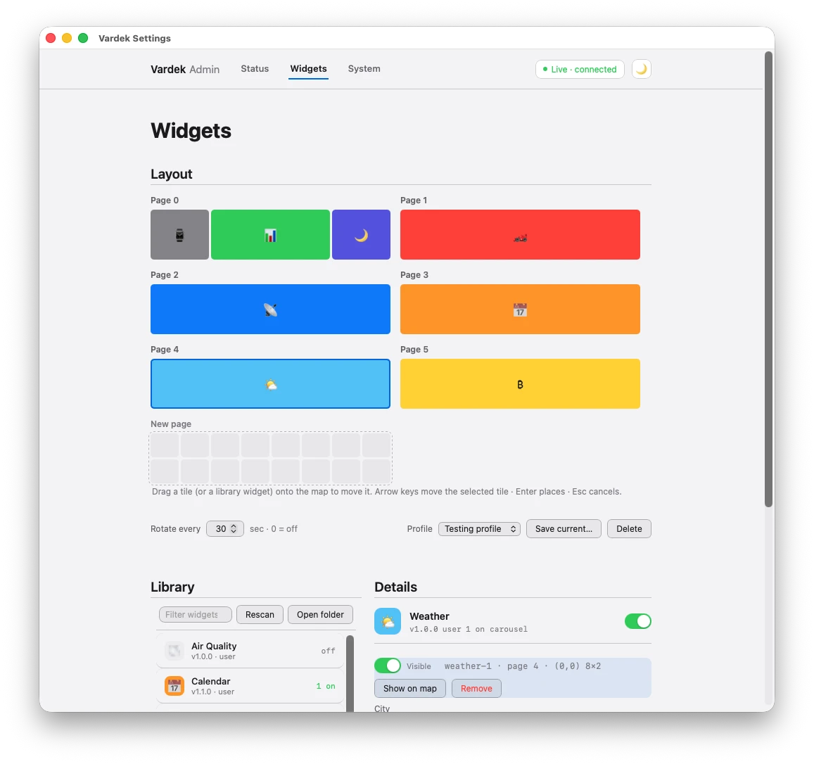
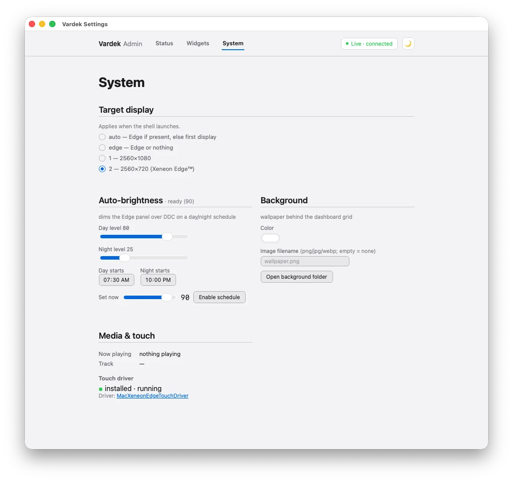

# Vardek

A local, Mac-native widget dashboard for the **Corsair Xeneon Edge™** touchscreen
(the 2560×720 USB-C secondary panel).

**Website:** [vardek.app](https://vardek.app) · **Download:** [latest release](https://github.com/vardekapp/Vardek/releases/latest) · **vs iCUE:** [comparison](https://vardek.app/vs-icue/)



## What it is

Corsair ships the Xeneon Edge™ widget layer only for Windows, through iCUE. On
macOS the 2560×720 panel arrives as a blank second display. Vardek rebuilds
that widget layer natively for the Mac: a full-screen, touch-driven grid of
eight bundled widgets plus any iCUE-format add-on you drop in, running
entirely on your machine. Free, macOS 13+, signed and notarized by Apple.

## Local-first

Whatever can run on your machine does. Clocks, the day/night terminator,
life-progress bars, and more are pure local math with no network at all; others
(like the ISS tracker) fetch only a tiny bit of data and compute the rest
on-device. When a widget does need live data — weather, launches, earthquakes —
it makes only the exact API calls its manifest lists, and nothing else leaves
your Mac. API keys live in the macOS Keychain, never in a plaintext config file.

## Requirements

- macOS 13 (Ventura) or later
- Apple Silicon Mac (CPU/GPU temperature sensors are Apple Silicon-only)
- A Corsair Xeneon Edge™ over USB-C (optional — Vardek also runs on any display
  so you can try it)

## Install

1. Download `Vardek-<version>.dmg` from the [latest release](https://github.com/vardekapp/Vardek/releases/latest).
2. Open it and drag **Vardek** to **Applications**.
3. Launch Vardek. The app is signed and notarized by Apple.

Verify the download against `SHA256SUMS` if you like:

```
shasum -a 256 -c SHA256SUMS
```

## Documentation

- [Setup](docs/setup.md) — install and first launch.
- [Touch setup](docs/touch-driver.md) — enable the touchscreen (community driver).
- [Troubleshooting](docs/troubleshooting.md) — common fixes.
- [Widget authoring guide](https://vardek.app/widgets/authoring/) — build your own widget.
- **In-app Help** (Vardek menu → Help, or ⌘?) — per-widget help pages, kept in sync with each widget's current behavior.

## Widgets

Eight widgets ship bundled, curated and fixed at install. Drop your own into
`~/Library/Application Support/Vardek/widgets/` and rescan — no app update needed.

**Add-on widgets:** install more after the fact — no app update — from
**[vardekapp/vardek-widgets](https://github.com/vardekapp/vardek-widgets)**.
That repo is open source; grab a widget, drop it in the folder above, rescan.
[Authoring guide](https://vardek.app/widgets/authoring/) and PRs welcome there too.

| | |
|---|---|
|  |  |
| **Weather** — current conditions, hourly, and a five-day outlook | **Calendar** — hero date with a three-month grid, instant first paint |
|  |  |
| **F1 Schedule** — next race, full weekend session timeline, season calendar, both championships on one surface | **UniFi Network** — glance summary plus per-device detail: name, model, IP, status, firmware |
|  | |
| **System Sensors** — CPU, memory, and network instruments that go amber past real thresholds and dim when data stops | |

**Also bundled:** **Clock** (time, kept honest by local math with no network at
all), **Sensor Gauge** (one sensor, one dial — pick the reading that matters),
and **Macro Pad** (touch buttons on the panel, wired to what you run most) —
see them live in-app (⌘? → per-widget Help) or via the ⌘A Admin panel.

## Admin

Manage everything from the Admin panel — open it as an app window (**Vardek menu →
Open Admin**, ⌘A) or in any browser at `http://127.0.0.1:8137/admin`. Placement,
settings, sensors, brightness, profiles — no config files to hand-edit.

Arranging the panel is direct manipulation: **drag widgets onto a live page map**
(or between pages, or onto a "New page" target), resize with per-widget size
chips, and filter the library as you type. The whole editor also works from the
keyboard, removals ask first and offer a 10-second **Undo**, and every change
confirms with a "Saved ✓" pulse.

| | |
|---|---|
|  |  |
| **Status** — daemon, panel, and live sensors at a glance | **Widgets** — arrange pages, browse the library, set options |
|  | |
| **System** — display, day/night brightness, touch-driver status | |

## Questions

<details>
<summary><strong>Does the Corsair Xeneon Edge work on a Mac?</strong></summary>
<br>

The panel does. Over USB-C or HDMI, macOS sees the Xeneon Edge™ as an ordinary
2560×720 second display. The widget layer does not: Corsair delivers that
through iCUE on Windows. On macOS the panel is a blank strip of desktop until
you run something on it. Vardek is what runs on it — see the
[full iCUE vs Vardek comparison](https://vardek.app/vs-icue/).
</details>

<details>
<summary><strong>Does Vardek send my data anywhere?</strong></summary>
<br>

No. The daemon binds to 127.0.0.1 and is not reachable off the machine. No
cloud, no account, no telemetry. The only network traffic is the API calls a
data widget explicitly makes, and those go through an audited proxy limited to
hosts the widget declares in its manifest. Full detail on the
[privacy page](https://vardek.app/privacy/).
</details>

<details>
<summary><strong>Can Vardek use iCUE widgets?</strong></summary>
<br>

Yes. Vardek reads the same `manifest.json` plus `index.html` format iCUE
widgets use, so community and Corsair marketplace widgets import directly.
Drop an add-on into the widgets folder, rescan, done. No app update needed —
see the [widget authoring guide](https://vardek.app/widgets/authoring/).
</details>

<details>
<summary><strong>How much does Vardek cost?</strong></summary>
<br>

Nothing. Vardek is free, closed source, and distributed as a signed and
notarized DMG through GitHub Releases. No paid tier, no subscription, no
account.
</details>

<details>
<summary><strong>Do I need a Xeneon Edge to run Vardek?</strong></summary>
<br>

No. Vardek runs full-screen on any macOS display, so you can try it before the
Edge™ arrives. The layout is built for the panel's 2560×720 shape and reads
best there, but nothing requires that hardware.
</details>

## Privacy

Local-only by design. All components run on your Mac over `127.0.0.1`; nothing
listens on your network. The only traffic that leaves your Mac is the specific
API call a widget you enable makes (e.g. Weather fetching a forecast), limited
to the exact hosts that widget declares. Full details at
[vardek.app/privacy](https://vardek.app/privacy/).

## License

Vardek is proprietary and **not open source** — the source that builds these
releases isn't published. What that license *doesn't* do: no telemetry, no
account, no DRM or anti-tamper clause, free forever. Binary builds are free to
use under the End User License Agreement bundled with the app. See
[`LICENSE`](LICENSE) and [`THIRD-PARTY-NOTICES.md`](THIRD-PARTY-NOTICES.md).

"Corsair" and "Xeneon" are trademarks of their respective owner; Vardek
references them only for hardware compatibility and is not affiliated with or
endorsed by Corsair.
